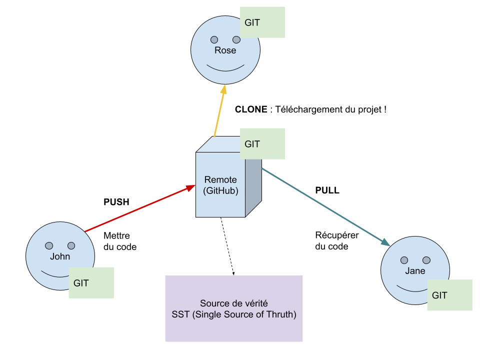
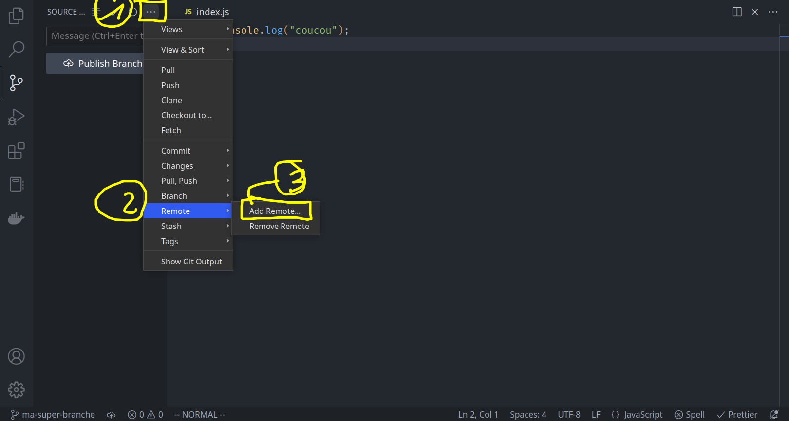
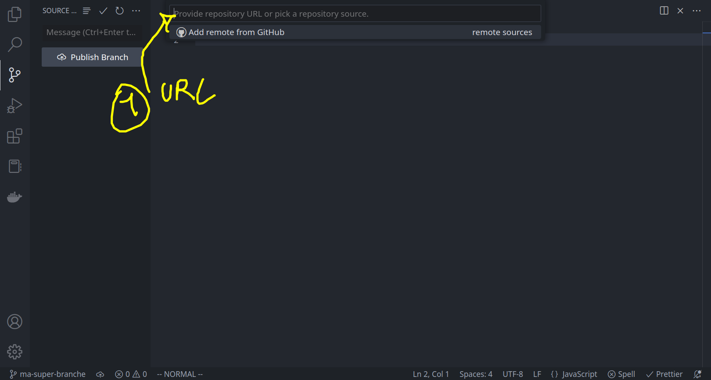
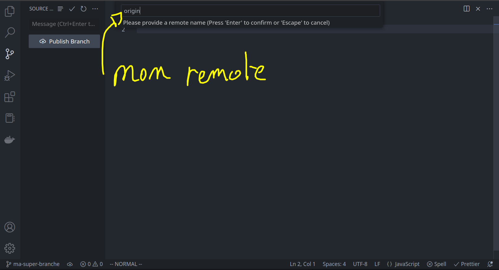
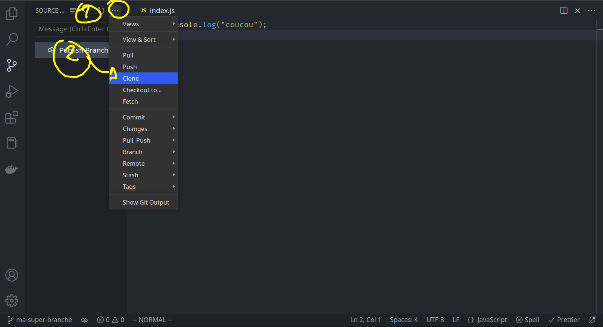
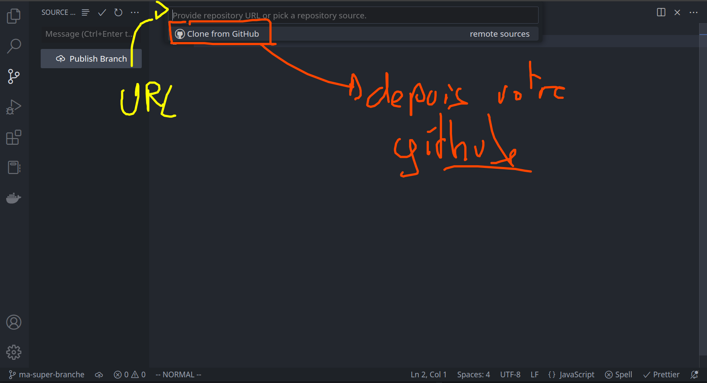
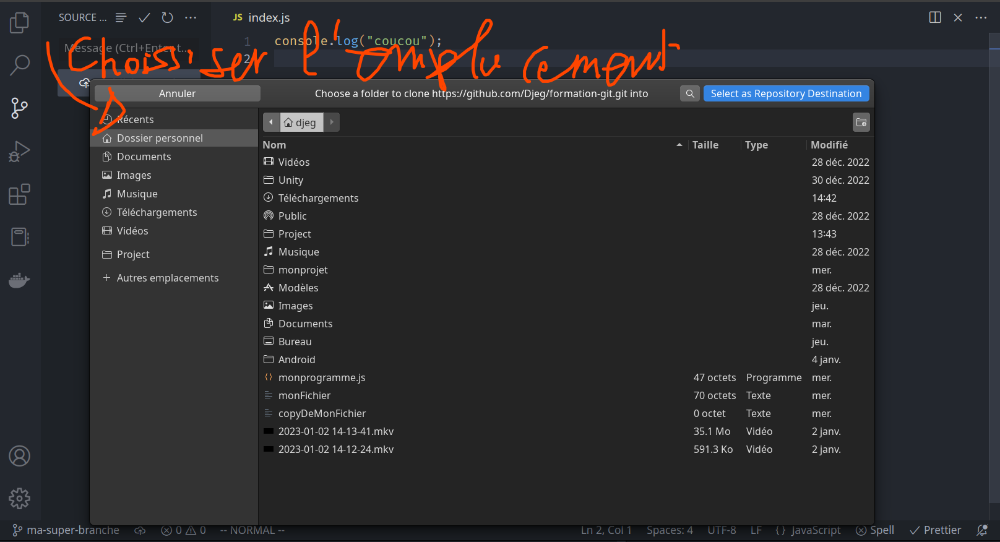
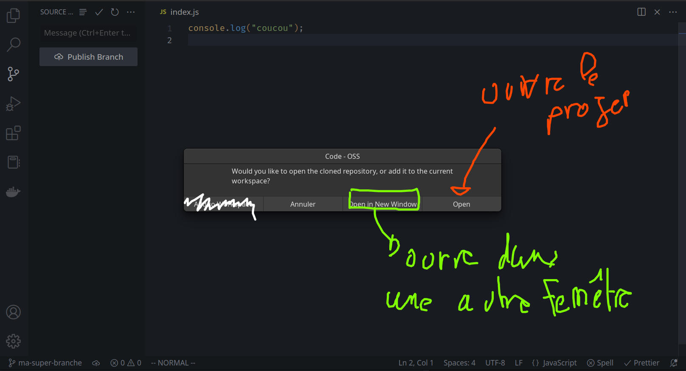
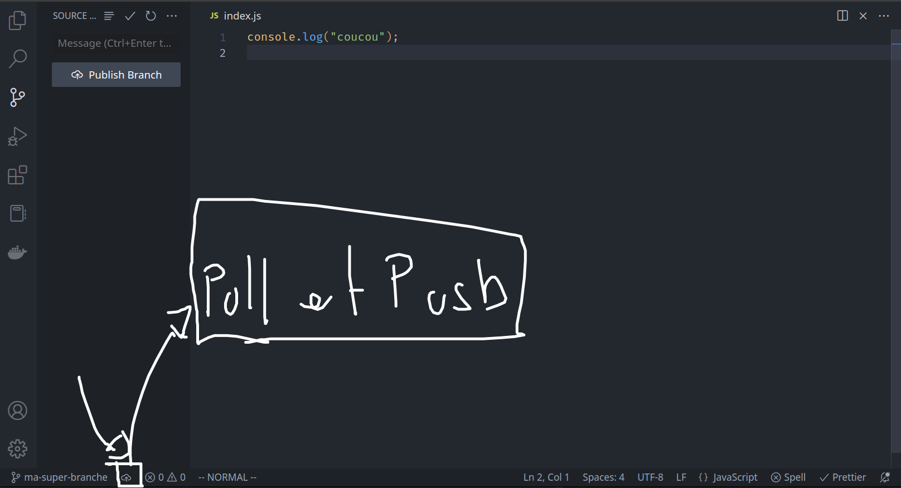

# Git : Les « remotes »

Jusqu'à maintenant nous avons appris à versionner un dossier de notre ordinateur. Cependant dans la vrai vie d'un projet, nous allons devoir partager ce dossier.

Pour cela GIT utilise un système que l'on appel les « remote » (serveur distant en français).

Il éxiste des « remotes » très célébre :

- [Github](https://github.com/)
- [GitLab](https://gitlab.com/gitlab-com)
- [BitBucket](https://bitbucket.org/)
- etc ...

## Comment ça fonctionne ?



## Configurer le remote

Afin de commencer à travailler en équipe, il faut un « remote ». Pour cela vous pouvez github, gitlab ou bitbucket. Une fois le « remote » créé (on parle aussi de **repository**), nous allons obtenir une **URL** !

À partir de cette url, nous pouvons configuerer notre git pour utiliser ce remote :

> Immaginons l'url suivante : `https://github.com/username/mon-projet`

Pour configurer le remote, je vais devoir utiliser les lignes de commandes suivante :

```bash
$ git remote add nomDuRemote https://github.com/username/mon-projet
```

> Un projet git peut parfois contenir (dans de très rare cas) plusieurs remotes. C'est pour ça que l'on peut nommé nos remote, histoire de s'y retrouver.

> Il éxiste un nom de base pour le remote c'est **origin**

> Il est aussi possible de lister les remote, si jamais nous sommes perdu : `git remote`

> Si jamais vous avez besoin, il est possible de « déconnécter » un remote : `git remote rm nomDuRemote`

### Avec vscode !





Nous n'avons pas toujours besoin de configurer un remote. Si le remote existe dèja, et que je suis tout nouveau sur le projet : je peux faire un **clone**

## Cloner un remote

Pour cloner un remote, il faut utiliser la commande :

```bash
$ git clone https://github.com/username/mon-projet
$ cd mon-projet
$ code .
```

> **ATTENTION** : Ici, la commande git clone vas créer un nouveaux dossier nommé "mon-projet" (c'est la dernière resource de l'url)

> Vous pouvez spécifier un autre argument au `clone` afin de choisir le nom du dossier :
>
> ```bash
> $ git clone https://... monDossier
> $ cd monDossier
> $ code .
> ```

### Utiliser VSCode !






## Le pull et le push

Il est possible de récupérer du travaille depuis github en utilisant la commande suivante :

```bash
$ git pull nomDuRemote branchDuRemote
```

> On télécharge toutes les modification du remote et on les ajoute chez nous :)

On peut aussi envoyer notre travaille sur github :

```bash
$ git push nomDuRemote
```

### Et avec vscode ...



> **Entrainez-vous**
>
> Créer un compte github, si ce n'est pas dèja fais. En utilisant créer un nouveau « repository » et nommé `test-formation-git`.
>
> Avec l'url fournie par github, et un terpminal ou vscode ajouter un remote sur le petit projet de ce matin.
>
> Une fois ce remote ajouté, utiliser le push afin de mettre le code sur github
>
> Créer un fichier `README.md` (si il n'éxiste pas dèja) placez y le code suivant :
>
> ```md
> Bonjour github
> ```
>
> Faite un commit (sur la branche principal) et ensuite un push !
>
> Partager l'url de votre github sur le chat :)

## Ignorer des dossier et fichier avec git

Il est possible dans un repository git d'ignore certains fichier et certains dossier. Tout ce passe dans un fichier à la racine du projet : `.gitignore`

Dans ce fichier, c'est très simple, chaque dossier ou fichier ignoré par git se situe les uns à la suite des autres :

```
test/
node_modules/
request.http
```

Il existe un caractère spéciale dans ce fichier c'est `*`. Lorsqu'on utilise `*` on spécifie que l'on veut « tout caractères » :

```
# ici on ignore tout les fchier se terminant par .php
*.php
# ici on ignore tout les fichier ou dossier commencant par test
test*
# on ignore tout ce qui contient test
*test*
```

> La caractère `#` permet de faire des commentaires.
